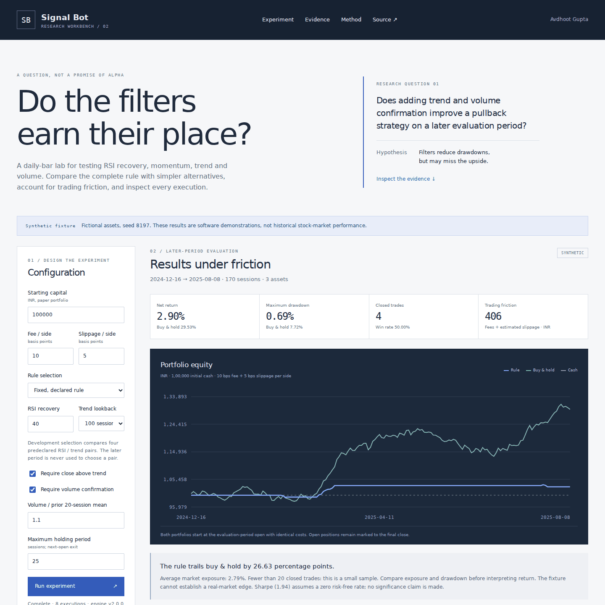

# Signal Bot · Research workbench

A reproducible daily-bar backtesting project by **Avdhoot Gupta**.

**Research question:** Does adding trend and volume confirmation improve an RSI-recovery strategy on a later evaluation period, after accounting for execution costs?



This project is a small research instrument. It supports an inspectable experiment rather than presenting random prices as historical stock performance. The default dataset contains three **fictional synthetic assets**, not NIFTY50 constituents. There is no brokerage connection or order routing.

## Try it

The frontend works as a static site, without a build or runtime dependencies:

```sh
python -m http.server 4174
```

Open `http://localhost:4174`. `signal_bot.html` redirects to the new `index.html`. Module workers require HTTP, rather than opening the file directly.

The included fixture uses seed 8197, 680 weekday sessions, three regimes and three fictional assets. It intentionally lacks a real exchange holiday calendar. Download its CSV, import the same bars, and reproduce the results. For real research, supply your own consistently adjusted daily OHLCV data and document its provenance.

## What makes the experiment inspectable

- **Causal execution:** completed-bar indicators produce signals; fills occur at the next available daily open, with directional slippage and fees on both sides.
- **Chronological selection:** development data occupy the first 75% of sessions. Its final 30% are the candidate-selection window; the last 25% are evaluated later. Warmup may use earlier bars, while portfolio cash resets for each window.
- **Declared candidates:** automatic mode compares four RSI / trend pairs (35 or 45; 100 or 200 sessions) on net development-validation return. Fixed mode preserves the declared rule.
- **Fair benchmarks:** equal-weight buy-and-hold uses the same assets, dates, starting capital and costs. Cash is also shown. Asset allocation is capped at an equal fraction per symbol, with whole shares and no borrowing.
- **Challenges to the hypothesis:** trend/volume entry-filter ablations and a transaction-cost sensitivity sweep are reported without choosing a new rule from later-period results. Exit rules stay identical across ablations.
- **Audit trail:** every execution includes its signal date, fill date, raw open, slipped fill, shares, fee, cash balance and reason. Closed trades and open positions remain separate.
- **Reproduction:** export the full JSON report, execution ledger, daily equity and input dataset. Reports include the engine version, selected parameters, split dates, assumptions and a SHA-256 content fingerprint.

## The included result is not a success claim

With the fixed default rule, the synthetic evaluation period is December 16, 2024–August 8, 2025 (170 sessions):

| Outcome | Rule | Buy-and-hold |
|---|---:|---:|
| Net return | 2.90% | 29.53% |
| Maximum drawdown | 0.69% | 7.72% |
| Closed trades | 4 | 0, positions remain open |
| Average market exposure | 2.79% | 99.65% |

The rule's lower drawdown comes with very low exposure and much lower return. Four closed trades are too few to establish a robust result. Removing the volume filter slightly improves return, while removing the trend entry filter reduces it. This mixed evidence is not a basis for selecting a real-market trading rule.

`examples/synthetic-experiment.json` and `examples/synthetic-dataset.csv` are reproducible evidence, not historical financial performance. Generate them with:

```sh
npm ci
npm run report
```

## Strategy and accounting

The entry rule combines:

1. Wilder RSI (14) recovering to the declared threshold after an oversold value in the preceding ten sessions.
2. A positive MACD histogram (12/26/9), with EMAs initialized from their simple-average warmup.
3. If enabled, close above a simple 100- or 200-session trend average.
4. If enabled, volume above the declared multiple of the **preceding** 20-session mean, excluding today's volume.

An RSI of at least 70, a close below the trend average, or the maximum holding period generates an exit for the next open. A holding-limit exit is first known at the close after the declared number of held sessions; the next-open fill can therefore occur one session later. No same-bar close fill or retrospective intrabar stop is assumed.

Cash is debited by purchase notional plus fees. Every daily equity point is cash plus current closing marks. Open positions remain open at the final close; their unrealized P&L includes entry fees, and they are excluded from win rate. Zero-trade win rate and zero-variance Sharpe are null rather than invented values. Returns are net of modelled trading costs; CAGR and Sharpe use 252 sessions per year, with a zero risk-free rate.

Execution timing follows the [next-bar order convention](https://www.backtrader.com/docu/order-creation-execution/order-creation-execution/). The engine is framework-independent and can be tested directly in Node.

## Import data

Required CSV columns, case-insensitive:

```csv
symbol,date,open,high,low,close,volume
ASSET_A,2023-01-02,100,102,99,101,50000
```

Use **400–10,000 sessions per asset**, 1–12 symbols, aligned dates and a file under 15 MB. ISO dates, positive prices, nonnegative volume, duplicate sessions, missing numeric cells and OHLC geometry are checked. Rows are sorted on a copy; gaps are not forward-filled. The uploader must document and confirm the consistent adjustment basis. The engine cannot independently verify corporate actions or provider quality.

CSV bars do not contain trustworthy seed or source metadata; import therefore labels them as imported, with the uploader's notes. A dataset exported from the synthetic fixture remains synthetic in substance even if imported again.

## Optional local persistence API

The same-origin FastAPI service serves the public frontend assets and stores experiments in SQLite:

```sh
python -m venv .venv
# Activate the environment using the command for your operating system.
pip install -r requirements.txt
python -m uvicorn main:app --host 127.0.0.1 --port 8000
```

Open `http://localhost:8000`; API documentation is at `/docs`. `SIGNAL_BOT_DB` overrides the database path. The existing `signal_bot.db` is preserved for compatibility; the frontend does not depend on it. Database and Python source files are never exposed as static assets.

| Routes | Purpose |
|---|---|
| `GET /health` | Engine/API version and persistence purpose |
| `GET, POST /configs`; `DELETE /configs/{id}` | Legacy named configuration storage |
| `GET, POST /backtests`; `GET, DELETE /backtests/{id}` | Legacy metric/ledger storage |
| `GET, POST /experiments`; `GET, DELETE /experiments/{id}` | Complete v2 experiment reports |

Report writes accept a name and an exported report: `{"name":"Trial","report":{...}}`. Payloads are bounded and must contain finite JSON. Configuration references are checked; deleted configuration references are cleared. The API stores client-computed results and does **not** independently verify market returns. The static interface uses downloadable files; API persistence is optional and exposed through `/docs`.

## Tests and continuous checks

```sh
npm ci
npm test
pip install -r requirements-dev.txt
python -m unittest discover -s tests -p 'test_*.py' -v
npx playwright install chromium
npm run test:e2e
```

The suite checks deterministic fixtures, CSV round trips and invalid inputs, indicator warmup, future-data invariance, next-open timing, hand-calculated cash/fee/slippage reconciliation, closed-trade P&L, zero-trade edge cases, development selection isolation, report persistence, private-file exclusion, responsive controls, real import flows and complete export metadata. GitHub Actions also regenerates the committed example and checks for drift.

## Limitations and next experiments

The supplied assets may introduce selection and survivorship bias. Taxes, market impact, liquidity constraints and corporate actions are not modelled. Sharpe and CAGR can be unstable on small samples; neither constitutes a significance test. Changing rules after inspecting the evaluation period makes the evidence exploratory, not an untouched holdout.

Next steps require new evidence: document a real adjusted dataset and universe; preregister the rule and evaluation dates; compare across additional market regimes; examine turnover and liquidity; and collect a genuinely forward evaluation period. Preserve negative findings rather than searching for an attractive fixture.

## Architecture

| Component | Responsibility |
|---|---|
| `engine.js` | Pure validation, features, accounting, benchmarks and experiment logic |
| `research-worker.js` | Nonblocking execution and SHA-256 fingerprint |
| `app.js` | Interface, dataset import and reproducible exports |
| `main.py` | Optional bounded SQLite persistence API |
| `scripts/generate-report.js` | Committed synthetic evidence generation |
| `tests/` | Research-engine, API and browser verification |

The original idea is retained, while the implementation makes the work easier to question, reproduce and explain in a portfolio conversation.
